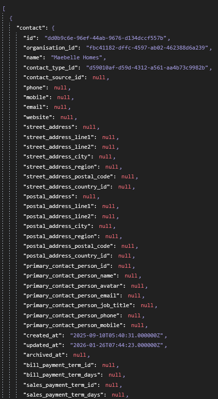
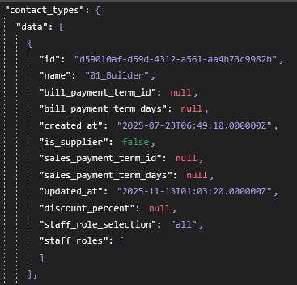
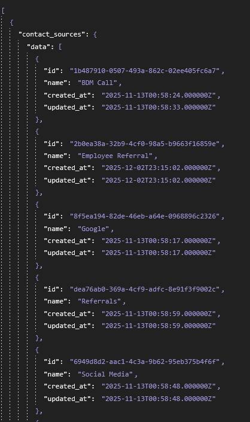

The Problem: 

Jobman Data - Quotes need the following Contact, Contact Type

/quotes
Quotes endpoint only contains quotes.contact_id which means we can't reference it directly and have to somehow connect it to contact endpoint etc

/contact
We get Contact through contact.name

but we only get contact.contact_type_id , and contact.contact_source_id meaning we have to somehow connect this to quote.id again so it's the same quote from the one that contact it.

/contact/types
We can then get the Contact Type through contact_types >

/contact/sources 

We can get the Contact Source through contact_sources > name 

